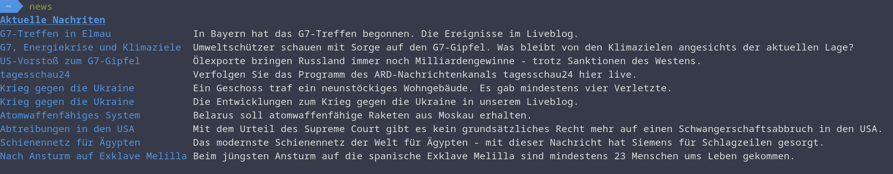

# news - Ein CLI für die Tagesschau API

news ist ein in GO geschriebenes Kommandozeilenwekzeug,
durch das man schnell und einfach einen Überblick
über die neusten Artikel der [Tagesschau API](https://www.tagesschau.de/api2/)
erhalten kann.

## Build

```shell
$ go build -o news *.go
```

## Examples

### weltweite Nachriten


### regionale Nachriten

